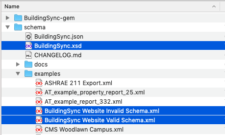
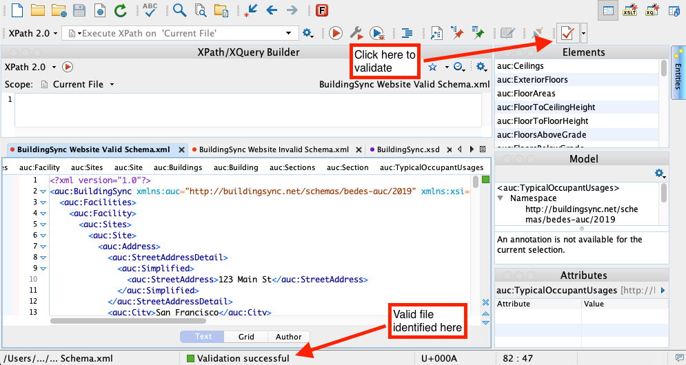
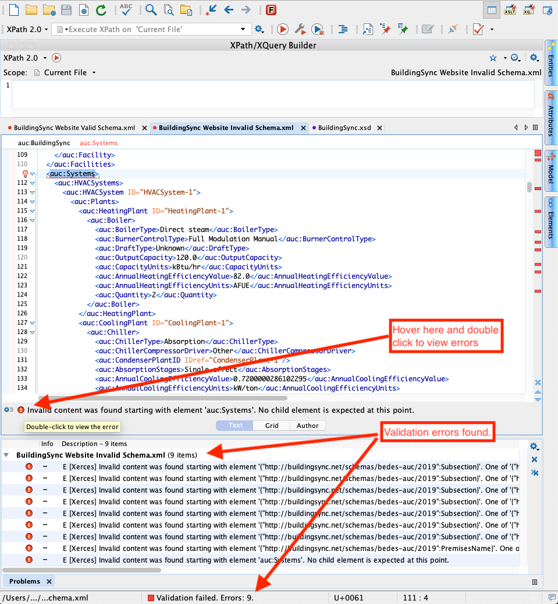
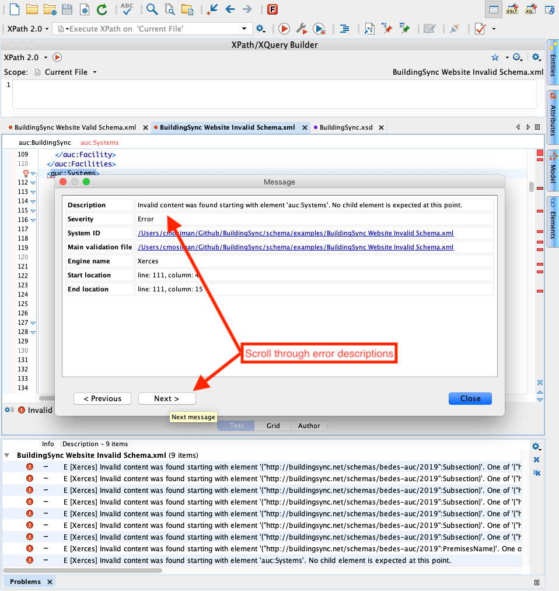
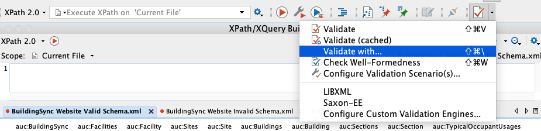
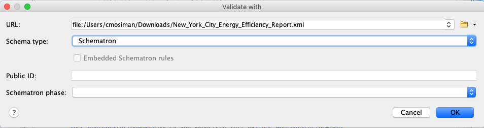
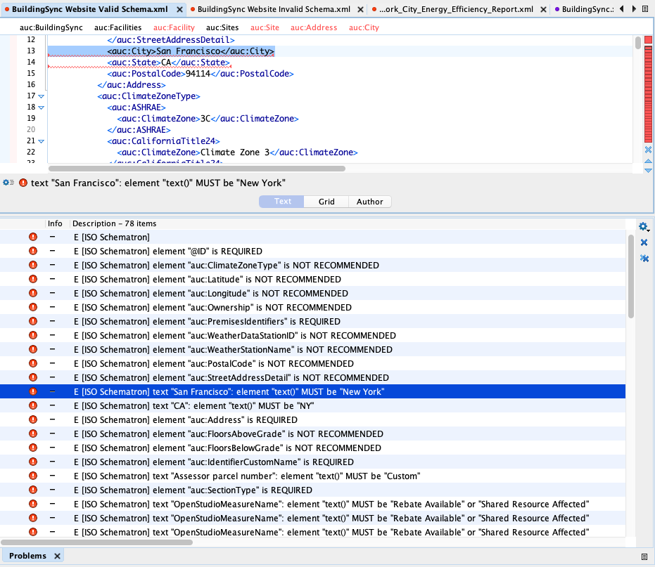

The following tools will help you adopt the BuildingSync® schema.

#### Use Case Selection Tool

[The BuildingSync Use Case Selection Tool](https://selectiontool.buildingsync.net) is a web application allowing users to browse and validate instances of BuildingSync for various use cases. There is no login needed for the website. If you have new use cases that you would like to be added, then contact [info@buildingsync.net](mailto:info@buildingsync.net) with your proposed use case and someone will be in touch with you.

#### File Validation

For validation of BuildingSync XML files, the XML file undergoes a two step validation process (see [Validation Using OxygenXML](#validation-using-oxygenxml) for an example):
1. Validation against an XML XSD document
	- Download the most recent version of the [schema](../schema) and use an XML authoring tool to validate the XML instances.
	- XSD's are used to validate [credit](https://www.youtube.com/watch?v=PpvX3izvRWU&list=PL73qvSDlAVViXEuAWaRFKul4gmYX9D-qL):
		- Elements and attributes that may appear in an XML document
		- Whether elements are required and how many are allowed
		- Whether attributes are required
		- Number and order of children
		- Data types for elements and attributes
		- Defaults and fixed values for elements and attributes
1. Validation using [Schematron](http://schematron.com/)
	- Currently (2019-11-06), there is only one example Schematron doc for the [Building Energy Asset Score](https://buildingenergyscore.energy.gov/) use case, which can be found [here](https://github.com/BuildingSync/assetscore-schematron-docs/blob/master/docs/Audit_Template/New_York_City_Energy_Efficiency_Report.xml). XML authoring tools can also be used to validate against Schematron docs.
	- As opposed to an XSD, a Schematron document can be used to validate:
		- Elemental requirements on a use case basis. For example, requirements for ASHRAE Levels 1, 2, and 3 are different. Using the same base XSD, with three different Schematron documents (one for each ASHRAE level), validates whether the document expresses all of the requirements to achieve each of the ASHRAE Level 1, 2, and 3 use cases.
		- Constraints and requirements based on conditionals. For example, if an element is specified with a particular value, the applicable enumerations of another element may change.
		- other logical statements.

Usage of both validation approaches (XSD and Schematron) is recommended for developers actively working on creating BuildingSync files.
- Validation against XSD for general correctness and usage of BuildingSync
- Validation against Schematron for understanding XML document requirements for different use cases

Additionally, there is an option to add a valid BuildingSync XML to the schema's continuous integration (CI) system. This will allow for the file to be tested during schema change/pull requests to ensure backward compatibility and validity. To add a BuildingSync instance to the CI, follow these steps:

1. If you do not have a GitHub account, then sign up for one on [GitHub](https://github.com)
1. Sign into GitHub and navigate to [BuildingSync Schema's GitHub page](https://github.com/buildingsync/schema)
1. Fork the repository and add new files to the [examples folder](https://github.com/BuildingSync/schema/tree/develop/examples)
1. Create a pull request which will trigger the validation workflow. If it passes, then the BuildingSync team will accept the pull request after reviewing the changes. If it does not pass, the BuildingSync team will work with you to understand the issues. Note: The new file will be validated on every commit/change to the BuildingSync schema ensuring that all provided user's files pass successfully and are backward compatible.

### Validation Using OxygenXML
Clone the [BuildingSync/schema](https://github.com/BuildingSync/schema) repository locally, and open the following files:
- 'BuildingSync.xsd'
- 'examples/BuildingSync Website Invalid Schema.xml'
- 'examples/BuildingSync Website Valid Schema.xml'

{:class="img-responsive"}

#### Validation Against XSD
Using the OxygenXML Validate button, the Valid Schema shows a valid result against the XSD:
{:class="img-responsive"}

For the invalid schema, we can see all of the errors found, with descriptions:

{:class="img-responsive"}

{:class="img-responsive"}

#### Validation Against Schematron
Download the Schematron document [Audit Template Example](https://raw.githubusercontent.com/BuildingSync/assetscore-schematron-docs/master/docs/Audit_Template/New_York_City_Energy_Efficiency_Report.xml) and save to a known local path.

In OxygenXML, choose the validate drop down, and select validate with:
{:class="img-responsive"}

{:class="img-responsive"}

The Schematron validator will provide very verbose errors specific to the use case.  Note that schematron will generate errors on both the 'BuildingSync Website Valid Schema.xml' and 'BuildingSync Website Invalid Schema.xml' documents, because while these are valid according to the XSD, they do not conform to the use case requirements:

{:class="img-responsive"}